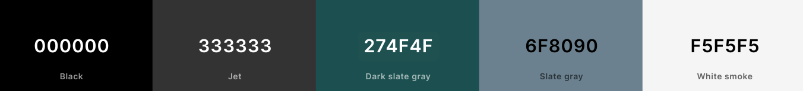

<h1 align="center">Milestone 2 Project- Seize the Day</h1>

Seize the Day is a productivity companion web application designed to help users manage tasks, track time effectively using the Pomodoro technique, and set reminders. The application provides a seamless user experience with features like dark mode support, automatic date and time updates, and a clean, responsive design.

- This project was completed for the Milestone 2 project in Level 5 Web Application and Development. It is designed to be responsive and accessible on a range of devices, making it easy to navigate for potential and returning patrons.

[View the live project here.](https://alexandrael9.github.io/MS1-dock9bar/index.html)

<h2 align="center"></h2>

## Planning

**Target Audience:**
People who wish to get out of the post-it/ write it on your hand trap! Keeping track of commitments is hard, particularly in this busy world. Seize the day is for anyone who wants a todo list, reminder tracker and timer in one. I'ts for anyone wishing to streamline their productivity and use their time more effectively.

**User Goals**
- Access the app with ease and resize to the required dimensions on desktop and mobile.
- Create to-do list items which can be added to, marked as completed and cleared in a simple and user friendly manner.
- Learn about the Pomodoro time blocking technique as a means to enhancing productivity and work/life balance.
- Use the Pomodoro timer as a means to block times of focus and ensure worklife balance with the introduction of breaks too.
- Set reminders for tasks which need to be completed at certain times of the day, for example, 'Attend tutor meeting- 4pm'.
- Exercise choice of display (dark/ light mode) for personal, or medical reasons.

**Site Owner Goals**
- Initially, I made this as a tool to help myself with my own organisation and productivity. It is a helpful tool.
- Increase User Productivity: The primary goal of the site is to help users manage their tasks and time effectively, ultimately increasing their productivity. This involves providing tools such as to-do lists, timers, and reminders.
- Enhance User Experience: to create an intuitive and user-friendly interface that makes it easy for users to navigate the application, add tasks, set timers, and receive reminders.

## User Experience (UX)

 ### User stories

 **First Time Visitor Goals**

1. As a First Time Visitor, I want to easily understand the main purpose of the site/ platform.
2. As a First Time Visitor, I want to be able to easily navigate throughout the platform and be able to interpret what I see clearly.
3. As a First Time Visitor, I would expect intuitive user interfaces, helpful tooltips, and possibly a guide me in the use and usefulness of the key functionalities.

  **Returning Visitor Goals**

1. Efficient Task Management: Returning visitors would aim to efficiently manage their tasks using the platform's features. They would want to quickly add, edit tasks to stay organized and productive.
 

  **Frequent User Goals**

1. Community Engagement: Frequent users might seek opportunities for community engagement, such as participating in forums, sharing productivity tips, or attending webinars or workshops hosted by the Seize the Day community.

### Planned Features To Achieve These Goals

- The website will use responsive design so it can be seen on different devices easily. 

**Dark Mode/Light Mode Toggle**
- Switch between dark and light modes for comfortable viewing in different lighting environments.
- Dark mode enhances visibility in low-light conditions and reduces eye strain.

**Automatic Date and Time Updates**
- Real-time display of the current date and time.
- Date and time automatically update every minute and second, respectively, providing accurate timekeeping.

**To-Do List**
- Easily add tasks to a dynamic to-do list.
- Mark tasks as completed with a single click for efficient task management.
- Clear the entire task list with a single button click.

**Pomodoro Timer**
- Implement the Pomodoro technique to enhance productivity and focus.
- Set customizable timers for Pomodoro sessions, short breaks, and long breaks.
- Receive visual and auditory notifications when each timer session ends.
- audio 'alarm' when timer finishes.

**Reminder Section**
- Set reminders with specific time and message inputs.
- Receive timely reminders displayed in a modal window.
- Track and manage reminders conveniently with a dynamically updated reminder list.

**Join the community Section**
- sign up to recieve newsletters

 ### Design

**Colour Scheme**

- `#333`: Dark gray, primarily used for background in dark mode and for certain text elements.
- `#whitesmoke`: Light gray, used for background in light mode and for contrast with darker elements.
- `#darkslategrey`: Dark slate gray, employed for headers, outlines, and certain text elements.
- `#slategrey`: Slate gray, used for button borders and certain text elements.

The dark gray (#333) serves as the background in dark mode, providing a sleek and modern aesthetic, while light gray (#whitesmoke) is employed for the background in light mode, maintaining readability and contrast with darker elements.

Dark slate gray (#darkslategrey) is predominantly used for headers, outlines, and certain text elements, adding emphasis to important sections. Slate gray (#slategrey) is reserved for button borders and certain text elements, providing a subtle contrast against the darker background.

Contrast between text and background colors is carefully considered to ensure optimal legibility. Dark text on a light background is used for body text to maximize readability, while lighter text on a dark background is used for headings to create visual interest and hierarchy.

These colours are used across both dark and light modes to maintain a sense of continuity however the usage of them differs across the modes to get the required effect.

#### Typography
- The typography for Seize the Day prioritizes readability, clarity, with a modern aesthetic to enhance the user experience. 
1. Font Family: The primary font is sans-serif, providing a clean and contemporary look. This choice enhances readability, especially on digital screens. It is also a very standard font so will be legiable on all browser etc.
2. Font Weight: Various font weights are utilized throughout the design to create visual hierarchy and emphasis. For example, bold weights are used for headings (h1, h2, h3) to make them stand out and grab attention, while lighter weights are used for body text to maintain readability.
3. Consistency: Consistency in typography across the website ensures a cohesive and unified design. The same font family, weights, and sizes are used consistently throughout various sections of the website, contributing to a harmonious visual aesthetic.

#### Imagery
-   I chose not to include images to keep the design clean and focused on utility.

### Wireframes
I used [Balsamiq Wireframes](https://balsamiq.com/wireframes/) to create wireframes before starting the project to help me plan the layout and flow of the project. 
When I was creating my website, the design plan was changed but only small placement changes.

 ### Homepage Wireframes

- [**Desktop and tablet**](./wireframes/main-page-desktop-tablet.png)
- [**Mobile**](./wireframes/main-page-tablet.png)

#### Error Page Wireframes

- [**Desktop and tablet**](./wireframes/ga-page-desktop.png)
- [**Mobile**](./wireframes/gallery-page-mobile.png)

## Technologies Used

### Languages Used

-   [HTML5](https://en.wikipedia.org/wiki/HTML5)
-   [CSS3](https://en.wikipedia.org/wiki/Cascading_Style_Sheets)
-   [Vanilla JavaScript](https://en.wikipedia.org/wiki/JavaScript)

### Frameworks, Libraries & Programs Used

1. [Bootstrap 4.1.3:](https://getbootstrap.com/docs/4.1/getting-started/introduction/)
- Bootstrap was used to assist with the responsiveness and styling of components in the website.
2. [jQuery:](https://jquery.com/)
- jQuery came with Bootstrap to make the navbar responsive.
3. [Git](https://git-scm.com/)
- Git was used for version control by utilizing the Gitpod terminal to commit to Git and Push to GitHub.
4. [GitHub:](https://github.com/)
- GitHub is used to store the projects code after being pushed from Git.
5. [Balsamiq:](https://balsamiq.com/)
- Balsamiq was used to create the wireframes as part of the design process.

## Testing
# Behavioural testing
- **Behavioural Testing**: involves verifying that the site's features and user interactions function as intended from the end-user's perspective. This includes ensuring that first-time visitors can easily understand and navigate the site, returning visitors can efficiently manage tasks, and frequent users can sign up to the newsletter/ join the community. By simulating real-world use cases, behavioural testing helps identify and address any issues in the user experience, ensuring the platform is intuitive, reliable, and meets the needs of its users. Throughout the development of this project, I did extensive behavioural testing was done as a means to check code was working as expected and problems fixed as and when need arised. The below table shows tests complete at the end of the project. 

### Functional Testing
- **Functional Testing**: Ensures all features work correctly, including navigation, task management, and timer functions etc.

| Test Case ID | Test Description                                                                                             | Expected Result                                                                                       | Pass/Fail | Comments                       |
|--------------|-------------------------------------------------------------------------------------------------------------|-------------------------------------------------------------------------------------------------------|-----------|-------------------------------|
| FT-01        | Verify the homepage loads correctly and displays the mission statement and feature overview                  | Homepage loads with a clear mission statement and an overview of key features                          |      Pass     |    Page loads quickly and correctly. Info clear on first view of page.                           |
| FT-02        | Verify navigation bar links (Join Us! button) work correctly                   | Link navigates to the modal to enter email to subscribe to the newsletter.                                                            |     Pass      |    Button opens email subscription modal                           |
| FT-03        | Verify the to-do list functionality (add, edit, complete, delete tasks)                                      | Users can add, edit, mark as complete, and delete tasks successfully                                   |     Pass      |                - Functions work as expected.  - Text input enters correctly. (Yes)  -Add task button creates new list item underneath input. (Yes)  -To-do section expands as list lengthens, when required (Yes) -done button draws line through completed task (Yes)  -Clear List button deletes entire list section (Yes)|
| FT-04        | Verify Pomodoro timer starts, pauses, and resets correctly                                                   | Timer functions (start, pause, reset) work as expected                                                 |     Pass      |            All timer functions work correctly and as expected:   '?' button opens Pomodoro explainer model (Yes) -Timer displays correct timer interval when either Pomodoro(25:00mins), Short Break(5:00mins) or Long Break(15:00mins) are clicked(Yes) -When timer buttons clicked, timer displays but does not start (Yes) -Start button starts countdown timer (yes) -Start button toggles to 'Pause' when timer running (Yes) -When pause button clicked, timer pauses (Yes) -When pause button clicked, timer button toggles to 'Start'(Yes) -When timer re-started, it resumes from last time, not starting again(Yes) -When timer completes, an alarm sounds (once) (Yes) -When timer completes, a modal appears telling users to either focus or take a break, depending on the timer type.(Yes)                 |
| FT-05        | Verify reminders can be set and notifications are received                                                   | Reminders can be set, and notifications are received at the correct time                               |     Pass      | Reminder functionality works: -Time input works(yes) -Message input works(Yes) -set reminder button creates new list item underneath with time and reminder message (Yes) -Modal triggered with reminder at correct time (yes)                              |
| FT-06        | Verify dark mode toggle changes the website theme                                                           | Dark mode toggle switches the theme between light and dark modes                                       |   Pass        |              Function works correctly:  -When pressed- page theme changes (Yes) -When pressed, button display toggles between dark mode and light mode. (Yes) -When in differing modes, externals like modals are also set to the correct theme (Yes)                 |
| FT-07        | Page displays the correct date and time                                             |      Page displays the correct date and time and updates when required     |                 Pass             |Functions work correctly: -On load correct date shows(Yes) -On load, page displays correct time, HH:MM (Yes) -When time changes, display changes to show correct time. (Yes)

### Usability Testing
- **Usability Testing**: Focuses on the user experience, ensuring the site is easy to understand and navigate, and that guides are effective.

| Test Case ID | Test Description                                                                                             | Expected Result                                                                                       | Pass/Fail | Comments                       |
|--------------|-------------------------------------------------------------------------------------------------------------|-------------------------------------------------------------------------------------------------------|-----------|-------------------------------|
| UT-01        | Verify the homepage clearly communicates the purpose of the site to first-time visitors                      | First-time visitors can easily understand the site's purpose                                           |      Pass     |             Purpose and intent evident                  |
| UT-02        | Verify site provides helpful information about key functionalities                                        | Site includes helpful information helpful information for possibly unclear/new time management technique, promoting benefit to user.                                      |       Pass    |      '?' button in Pomodoro section opens a modal which explains the use of a Pomodoro timer to aid productivity and work/life balance.                         |                   
| UT-03        | Verify the user interface is intuitive and easy to navigate                                                  | Users can easily navigate the site without confusion                                                   |    Pass       |   Site uses commonly recognised tools and layout features and tools which will be known to users. Site is well spaced, with only key content used in order to remain uncluttered. Buttons linking to modals allow for more info to be given without cluttering up the interface and can be accessed only as and when the user feels they may need it.                            | 

### Performance Testing
- **Performance Testing**: Ensures the site loads quickly and performs well.

| Test Case ID | Test Description                                                                                             | Expected Result                                                                                       | Pass/Fail | Comments                       |
|--------------|-------------------------------------------------------------------------------------------------------------|-------------------------------------------------------------------------------------------------------|-----------|-------------------------------|
| PT-01        | Verify the website loads within an acceptable time frame (e.g., under 3 seconds)                             | Website loads within the acceptable time frame                                                         |           |                               |

### Compatibility Testing
- **Compatibility Testing**: Ensures the site works across different browsers and devices.

| Test Case ID | Test Description                                                                                             | Expected Result                                                                                       | Pass/Fail | Comments                       |
|--------------|-------------------------------------------------------------------------------------------------------------|-------------------------------------------------------------------------------------------------------|-----------|-------------------------------|
| CT-01        | Verify the website works correctly on different browsers (Chrome, Firefox, Safari, Edge)                     | Website functions correctly on all major browsers                                                      |           |                               |
| CT-02        | Verify the website is responsive and works on various devices (desktop, tablet, mobile)                      | Website is responsive and works on various devices                                                     |           |                               |

### Accessibility Testing
- **Accessibility Testing**: Ensures the site is accessible to all users, including those with disabilities.

| Test Case ID | Test Description                                                                                             | Expected Result                                                                                       | Pass/Fail | Comments                       |
|--------------|-------------------------------------------------------------------------------------------------------------|-------------------------------------------------------------------------------------------------------|-----------|-------------------------------|
| AT-01        | Verify the website meets accessibility standards (e.g., WCAG 2.1)                                            | Website meets accessibility standards, ensuring it is usable by people with disabilities               |           |                               |

### Validator Testing
- **Validator Testing**: Ensures that the website's code adheres to established standards and best practices, which helps improve functionality, accessibility, and cross-browser compatibility.

| Test Case ID | Test Description                                                                                             | Expected Result                                                                                       | Pass/Fail | Comments                       |
|--------------|-------------------------------------------------------------------------------------------------------------|-------------------------------------------------------------------------------------------------------|-----------|-------------------------------|
| VT-01        | HTML: code adheres to standards and best practices when run through the validator               |           |                               |
| VT-02        | CSS: code adheres to standards and best practices when run through the validator               |           |                               |
| VT-03        | JavaScript: code adheres to standards and best practices when run through the validator               |           |                               |

# Automated testing
- **Automated Testing**: Automated testing is the use of software tools and scripts to execute pre-defined test cases on a software application without manual intervention. It aims to verify that the application functions correctly and meets specified requirements. Automated testing can significantly speed up the testing process, improve accuracy by eliminating human error, and allow for more frequent and thorough testing, especially for repetitive tasks and regression tests. This approach is especially useful in continuous integration and continuous deployment (CI/CD) pipelines, ensuring that new code changes do not introduce defects.
- **Possible Uses in this project**:
- 
-

### Navigation bar links. 
Home, Gallery, Contact and Menus pages jump to the respective places when clicked. 
- These were tested a number of times. An issue arose when the site moved from the local browswe to published throu Girhub Pages. When this happend the links stopped working and an 'Error 404' page was shown. This was rectified by editing the filepaths to remove "/" at the beginning.

### Carousel Controls. 
Tested gallery controls checking carousel only moves on as a result of user input.
- The default of the Bootstrap carousel was that it would run automatically however I only wanted the image carousel to move as a result of user input. 
 
- My first attempt was the change the 'data-ride="carousel"' to 'data-ride="none"'. However, this only changed the behaviour of the first slide, once past the first slide, the rest of the carousel ran automatically.
- After a deep dive into Bootstrap's documentation I added data-interval="false"' to the carousel div to disable the automatic cycling through the slides. 

### Social media links open in the correct destination and in a new tab when clicked.

- All links include 'target="_blank"' to ensure links open in a new tab.

### Contact Page Form. 
- Tested the form on the Contact page. All required fields worked and the submission button worked.

### Subscription Form.
- Tested the form on the Contact page. All required fields worked and the submission button worked.
 

### Browser Testing.
- Tested with different browsers such as Chrome, Firefox, and Safari(using my phone).

### Screensize and responsivity Testing.
- Tested with different screen sizes using the developer tool (Galaxy Fold, iPad, and my laptop)
    - - The site uses bootstrap across all pages to use a 1, 2, or 3 column layout. One column for small screen sizes, 2 columns for medium screen sizes and 3 columns for large screen sizes. 

**Homepage examples**

**Navbar examples**
- The site utilises a bootstrap component to collapse the navbar menu items into a toggle when viewing the site on small screens to keep the page neat and tidy.

**Form examples**
- The site utilises media queries to organise form elements on the page in order ro manage space and content effectively. While the site as a whole uses a 3-2-1 bootstrap column design, I found that while this worked on small screens, it was not effective on medium to large screens as the half header half form weighting was not an effective use of space. After some reading I decided to add a media query to both the contact form and the subscription form. This media query and html changed the page make-up so that the header took up one third of the horixontal space while the form element took up two thirds. I also centered the header vertically to even out the use of space.

### Validator Testing

The W3C Markup Validator and W3C CSS Validator Services were used to validate every page of the project to ensure there were no syntax errors in the project.

**HTML**

-   [W3C Markup Validator index.html](https://jigsaw.w3.org/css-validator/#validate_by_input) - [Results](/docs/testing/w3c-index.html-validator.png)
- - There were some 'Warnings' to do with header elements however these warnings do not take into account that the header for the content is in the previous section and the 'possible' misuse of an aria-label on my map. As these are warnings and not errors I ignored them. 

-   [W3C Markup Validator gallery.html](https://jigsaw.w3.org/css-validator/#validate_by_input) - [Results](/docs/testing/w3c-gallery.html-validator.png)

-   [W3C Markup Validator contact.html](https://jigsaw.w3.org/css-validator/#validate_by_input) - [Results](/docs/testing/w3c-contact.html-validator.png)
- - There was an issue with duplicate tags as this page had two forms on - one for contact and one for subscription- I edited the id's and labels to section specific ones. This fixed the issue.

-   [W3C Markup Validator menus.html](https://jigsaw.w3.org/css-validator/#validate_by_input) - [Results](/docs/testing/w3c-menus.html-validator.png)
- - There was an issue with duplicate and stray div tags. Quick format and check and removed eroneous tag.

**CSS**
-   [W3C CSS Validator](https://jigsaw.w3.org/css-validator/#validate_by_input) - [Results](/docs/testing/w3c-css-validator-1.png)
-This brought the above error. I rectified it and retested. - [Results](/docs/testing/w3c-css-validator-2.png)

### Chrome's DevTools Audit Report

The Google Page-speed Services were used to assess the accessibiity of the project to ensure the site met expected accessible standards on desktop and mobile.

- In early development of the site, the site used two shades of green as opposed to blue. Through testing while coding, it became apparent that these colours did not work well from an accessibility standpoint as there was not enouth contrast. As part of the iterative process, I changed my scheme from green to blues which offered better contrast and accessibility.

-SEO score could be improved by adding a meta description tag to the head. 
-Page performance is an issue- possibly down to the large size of the main image on the site. Next steps would be to investigate reducing images without sacrificing quality.

### Lighthouse DevTools Audit Report

Lighthouse was used to assess the accessibiity of the project to ensure the site met expected accessible standards on desktop and mobile.

-SEO score could be improved by adding a meta description tag to the head. 
-Page performance is an issue- possibly down to the large size of the main image on the site. As above, Next steps would be to investigate reducing images without sacrificing quality.

### Testing User Stories from User Experience (UX) Section

- #### First Time Visitor Goals
1. As a First Time Visitor, I want to easily understand the main purpose of the site/ platform. 
**1a.** Solution: The website's landing page features a clear and concise tagline or mission statement that explains the main purpose of the platform: to help users manage their time and tasks efficiently. Additionally, the homepage includes a brief overview of key features such as the Pomodoro timer, to-do list, reminders, and dark mode toggle. This immediate clarity helps first-time visitors understand what the site offers.
 

- The main basic information is put across first (who,what,where,when) 

2. As a First Time Visitor, I want to be able to easily navigate throughout the platform and be able to interpret what I see clearly. 
**2a** Solution: The website uses a simple, intuitive layout with a top navigation bar that clearly labels each section (e.g., Home, To-Do List, Timer, Reminders, Community). Each section is also accessible from the homepage via prominent buttons or links. The use of icons and clear headings further aids navigation, making it easy for users to find and understand each feature. The design for inputs etc has been deliberatly chosen to be familiar with tools and functions used often ensuring ease of understanding and use.

3. As a First Time Visitor, I would expect intuitive user interfaces, helpful tooltips, and possibly a guide me in the use and usefulness of the key functionalities. 
**3a** Solution: The user interface is designed to be intuitive, with interactive elements like buttons and input fields clearly marked. A guide is provided for the function which may or ma not be familaiar to the user, (the pomodoro timer), explaining what the function is and how it can be beneficial to the user. It is a modal which is accessed via a button close to the heading

 

- #### Returning Visitor Goals
1. Efficient Task Management: Returning visitors would aim to efficiently manage their tasks using the platform's features. They would want to quickly add, edit tasks to stay organized and productive. 
**1a** Solution: Returning visitors can quickly manage their tasks through the streamlined to-do list feature. Tasks can be easily added, edited, marked as complete, or deleted. The interface is designed for quick access and minimal clicks, ensuring users can update their tasks efficiently.

- #### Frequent User Goals
1. Community Engagement: Frequent users might seek opportunities for community engagement, such as participating in forums, sharing productivity tips, or attending webinars or workshops hosted by the Seize the Day community. 
**1a** Solution: The website fosters community engagement through an option to be put on a mailing list to be kept up to dat with upgrades, news etc.

### Further Testing
-   A large amount of repeated testing was done to ensure that all pages were linking correctly.
-   Friends and family members were asked to review the site and documentation to point out any bugs and/or user experience issues.

### Known Bugs/ issues
**Performance**
- Performance needs to be enhanced, especially load time, and investigation work done around images slowing page performance down without sacrificing image quality.

**Coding issues**
- I came across an issue while building the site. This issue was made evident when viewing the menu page in smaller screens. Some horizontal sections of the page had white, empty space on the right hand side.
- - In the first instance, I added "container-fluid" to the required sections. While this worked with some sections - the coloured background spread to fit the viewport - the section with the menu cards and images was still pushing out to the edges and creating white space. I looked deeper into the bootstrap code.

- - Firstly I removed any default dimensions and measurements relating to the card image so that I could control this in css. 
  

- - I then used css to change the width to 100% so the image will not push out its container.

### Improvements/ scalability 
- Drive User Engagement: develop the site further and aim to encourage users to spend more time on the platform by offering more of a range engaging features such as interactive timers, customizable to-do lists, and helpful reminders. A range of backgrounds could also be provided making the UI more personal to users.
- Build more functionality for greater customization and personalization: Frequent users may value customization options that allow them to tailor the platform to their preferences. They might want to customize task categories, timer durations, reminder settings, and the overall layout to suit their workflow. This could also include extra functionality tracking healthy habits such as water drinking, portions of fruit and veg or active minutes.
- Tracking Progress: Returning/ frequent visitors may be interested in tracking their progress over time. They would use features such as task completion tracking and time logs to monitor their productivity and identify areas for improvement.
## Deployment

### GitHub Pages
This site was deployed using GitHub pages.

1. Log in to GitHub and locate the [GitHub Repository](https://github.com/)
2. At the top of the Repository (within the grey bar), locate the "Settings" Button on the menu.
3. Scroll down the Settings menu on the left hand side until you locate the "Pages" Section. Click "Pages".
4. Under "Source", click the dropdown called "None" and select "Branch". Save.
5. The page will refresh.
6. Go to "Pages" to locate the now published site [link](https://github.com) in the "GitHub Pages" section.

### Forking the GitHub Repository
Forking the GitHub Repository creates a copy of the original repository on our GitHub account which enables us to make changes without changing the original. 
1. Log in to GitHub and locate the [GitHub Repository](https://github.com/)
2. At the top of the Repository (within the grey bar) just close to the "Settings" Button on the menu, find the "Fork" Button. Click
3. You should now have a copy of the repository in your GitHub account.

### Making a Local Clone
1. Log in to GitHub and locate the [GitHub Repository](https://github.com/)
2. Under the repository name, click "Clone or download".
3. To clone the repository using HTTPS, under "Clone with HTTPS". Copy the link.
4. Open Git Bash
5. Change the current working directory to the location where you want the cloned directory to be made.
6. Type "git clone". Paste the URL you copied in Step 3.
7. Press Enter. Now local clone will be created.

Click [Here](https://help.github.com/en/github/creating-cloning-and-archiving-repositories/cloning-a-repository#cloning-a-repository-to-github-desktop) to access github docs and learn more about the process.

## Credits

### Code

-   [Bootstrap4](https://getbootstrap.com/docs/4.4/getting-started/introduction/): Bootstrap Library used throughout the project mainly to make site responsive using the Bootstrap Grid System. Bootstrap was also used as the base code for the forms, jumbotron the image carousel.
- I referred to  the [W3 schools](https://www.w3schools.com/html/default.asp) website's HTML and CSS sections in order to check syntax.
- I also referred to [StackOverflow] (https://stackoverflow.com/)
- I adapted the basic code from notes following the "Whiskey Drop" tutorials from the Code Institute website to achieve the navbar and the reviews sections.
- I utilised [Free Formatter](https://www.freeformatter.com/) to check the formatting of my code.

### Content

-  All content was written by the developer unless otherwise stated in the credits.

### Media
- Sound file for pomodoro alarm.

### Acknowledgements

-   My Mentor Excellence Ilesanmi for continuous helpful feedback.
-   My tutor from EKC Group Rachel Furlong for support in Tutor meetings.
-   The Code Institute Slack Channel.