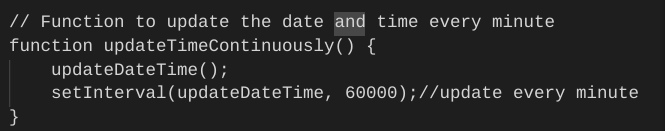

<h1 align="center">Milestone 2 Project- Seize the Day</h1>

Seize the Day is a productivity companion web application designed to help users manage tasks, track time effectively using the Pomodoro technique, and set reminders. The application provides a seamless user experience with features like dark mode support, automatic date and time updates, and a clean, responsive design.

- This project was completed for the Milestone 2 project in Level 5 Web Application and Development. It is designed to be responsive and accessible on a range of devices, making it easy to navigate for potential and returning patrons.

[View the live project here.](https://alexandrael9.github.io/MS2-seize-the-day/)

<h2 align="center"></h2>

## Planning

**Target Audience:**
People who wish to get out of the post-it/ write it on your hand trap! Keeping track of commitments is hard, particularly in this busy world. Seize the day is for anyone who wants a todo list, reminder tracker and timer in one. I'ts for anyone wishing to streamline their productivity and use their time more effectively.

**User Goals**
- Access the app with ease and resize to the required dimensions on desktop and mobile.
- Create to-do list items which can be added to, marked as completed and cleared in a simple and user friendly manner.
- Learn about the Pomodoro time blocking technique as a means to enhancing productivity and work/life balance.
- Use the Pomodoro timer as a means to block times of focus and ensure worklife balance with the introduction of breaks too.
- Set reminders for tasks which need to be completed at certain times of the day, for example, 'Attend tutor meeting- 4pm'.
- Exercise choice of display (dark/ light mode) for personal, or medical reasons.

**Site Owner Goals**
- Initially, I made this as a tool to help myself with my own organisation and productivity. It is a helpful tool.
- Increase User Productivity: The primary goal of the site is to help users manage their tasks and time effectively, ultimately increasing their productivity. This involves providing tools such as to-do lists, timers, and reminders.
- Enhance User Experience: to create an intuitive and user-friendly interface that makes it easy for users to navigate the application, add tasks, set timers, and receive reminders.

## User Experience (UX)

 ### User stories

 **First Time Visitor Goals**

1. As a First Time Visitor, I want to easily understand the main purpose of the site/ platform.
2. As a First Time Visitor, I want to be able to easily navigate throughout the platform and be able to interpret what I see clearly.
3. As a First Time Visitor, I would expect intuitive user interfaces, helpful tooltips, and possibly a guide me in the use and usefulness of the key functionalities.

  **Returning Visitor Goals**

1. Efficient Task Management: Returning visitors would aim to efficiently manage their tasks using the platform's features. They would want to quickly add, edit tasks to stay organized and productive.
 

  **Frequent User Goals**

1. Community Engagement: Frequent users might seek opportunities for community engagement, such as participating in forums, sharing productivity tips, or attending webinars or workshops hosted by the Seize the Day community.

### Planned Features To Achieve These Goals

- The website will use responsive design so it can be seen on different devices easily. 

**Dark Mode/Light Mode Toggle**
- Switch between dark and light modes for comfortable viewing in different lighting environments.
- Dark mode enhances visibility in low-light conditions and reduces eye strain.

**Automatic Date and Time Updates**
- Real-time display of the current date and time.
- Date and time automatically update every minute and second, respectively, providing accurate timekeeping.

**To-Do List**
- Easily add tasks to a dynamic to-do list.
- Mark tasks as completed with a single click for efficient task management.
- Clear the entire task list with a single button click.

**Pomodoro Timer**
- Implement the Pomodoro technique to enhance productivity and focus.
- Set customizable timers for Pomodoro sessions, short breaks, and long breaks.
- Receive visual and auditory notifications when each timer session ends.
- audio 'alarm' when timer finishes.

**Reminder Section**
- Set reminders with specific time and message inputs.
- Receive timely reminders displayed in a modal window.
- Track and manage reminders conveniently with a dynamically updated reminder list.

**Join the community Section**
- sign up to recieve newsletters

 ### Design

**Colour Scheme**

- `#333`: Dark gray, primarily used for background in dark mode and for certain text elements.
- `#whitesmoke`: Light gray, used for background in light mode and for contrast with darker elements.
- `#darkslategrey`: Dark slate gray, employed for headers, outlines, and certain text elements.
- `#slategrey`: Slate gray, used for button borders and certain text elements.

The dark gray (#333) serves as the background in dark mode, providing a sleek and modern aesthetic, while light gray (#whitesmoke) is employed for the background in light mode, maintaining readability and contrast with darker elements.

Dark slate gray (#darkslategrey) is predominantly used for headers, outlines, and certain text elements, adding emphasis to important sections. Slate gray (#slategrey) is reserved for button borders and certain text elements, providing a subtle contrast against the darker background.

Contrast between text and background colors is carefully considered to ensure optimal legibility. Dark text on a light background is used for body text to maximize readability, while lighter text on a dark background is used for headings to create visual interest and hierarchy.

These colours are used across both dark and light modes to maintain a sense of continuity however the usage of them differs across the modes to get the required effect.

#### Typography
- The typography for Seize the Day prioritizes readability, clarity, with a modern aesthetic to enhance the user experience. 
1. Font Family: The primary font is sans-serif, providing a clean and contemporary look. This choice enhances readability, especially on digital screens. It is also a very standard font so will be legiable on all browser etc.
2. Font Weight: Various font weights are utilized throughout the design to create visual hierarchy and emphasis. For example, bold weights are used for headings (h1, h2, h3) to make them stand out and grab attention, while lighter weights are used for body text to maintain readability.
3. Consistency: Consistency in typography across the website ensures a cohesive and unified design. The same font family, weights, and sizes are used consistently throughout various sections of the website, contributing to a harmonious visual aesthetic.

#### Imagery
-   I chose not to include images to keep the design clean and focused on utility.

### Wireframes
I used [Balsamiq Wireframes](https://balsamiq.com/wireframes/) to create wireframes before starting the project to help me plan the layout and flow of the project. 
When I was creating my website, the design plan was changed but only small placement changes.

 ### Homepage Wireframes

- [**Desktop and tablet**](./wireframes/main-page-desktop-tablet.png)
- [**Mobile**](./wireframes/main-page-tablet.png)

#### Error Page Wireframes

- [**Desktop and tablet**](./wireframes/error-desktop-tablet.png)
- [**Mobile**](./wireframes/error-mobile.png)

## Technologies Used

### Languages Used

-   [HTML5](https://en.wikipedia.org/wiki/HTML5)
-   [CSS3](https://en.wikipedia.org/wiki/Cascading_Style_Sheets)
-   [Vanilla JavaScript](https://en.wikipedia.org/wiki/JavaScript)

### Frameworks, Libraries & Programs Used

1. [Bootstrap 4.1.3:](https://getbootstrap.com/docs/4.1/getting-started/introduction/)
- Bootstrap was used to assist with the responsiveness and styling of components in the website.
2. [jQuery:](https://jquery.com/)
- jQuery came with Bootstrap to make the navbar responsive.
3. [Git](https://git-scm.com/)
- Git was used for version control by utilizing the Gitpod terminal to commit to Git and Push to GitHub.
4. [GitHub:](https://github.com/)
- GitHub is used to store the projects code after being pushed from Git.
5. [Balsamiq:](https://balsamiq.com/)
- Balsamiq was used to create the wireframes as part of the design process.

## Testing
# Behavioural testing/ BDD
- **Behavioural Testing**: involves verifying that the site's features and user interactions function as intended from the end-user's perspective. This includes ensuring that first-time visitors can easily understand and navigate the site, returning visitors can efficiently manage tasks, and frequent users can sign up to the newsletter/ join the community. By simulating real-world use cases, behavioural testing helps identify and address any issues in the user experience, ensuring the platform is intuitive, reliable, and meets the needs of its users. Throughout the development of this project, I did extensive behavioural testing was done as a means to check code was working as expected and problems fixed as and when need arised. The below table shows tests complete at the end of the project. 

### Functional Testing
- **Functional Testing**: Ensures all features work correctly, including navigation, task management, and timer functions etc.

| Test Case ID | Test Description                                                                                             | Expected Result                                                                                       | Pass/Fail | Comments                       |
|--------------|-------------------------------------------------------------------------------------------------------------|-------------------------------------------------------------------------------------------------------|-----------|-------------------------------|
| FT-01        | Verify the homepage loads correctly and displays the mission statement and feature overview                  | Homepage loads with a clear mission statement and an overview of key features                          |      Pass     |    Page loads quickly and correctly. Info clear on first view of page.                           |
| FT-02        | Verify navigation bar links (Join Us! button) work correctly                   | Link navigates to the modal to enter email to subscribe to the newsletter.                                                            |     Pass      |    Button opens email subscription modal                           |
| FT-03        | Verify the to-do list functionality (add, edit, complete, delete tasks)                                      | Users can add, edit, mark as complete, and delete tasks successfully                                   |     Pass      |                - Functions work as expected.  - Text input enters correctly. (Yes)  -Add task button creates new list item underneath input. (Yes)  -To-do section expands as list lengthens, when required (Yes) -done button draws line through completed task (Yes)  -Clear List button deletes entire list section (Yes)|
| FT-04        | Verify Pomodoro timer starts, pauses, and resets correctly                                                   | Timer functions (start, pause, reset) work as expected                                                 |     Pass      |            All timer functions work correctly and as expected:   '?' button opens Pomodoro explainer model (Yes) -Timer displays correct timer interval when either Pomodoro(25:00mins), Short Break(5:00mins) or Long Break(15:00mins) are clicked(Yes) -When timer buttons clicked, timer displays but does not start (Yes) -Start button starts countdown timer (yes) -Start button toggles to 'Pause' when timer running (Yes) -When pause button clicked, timer pauses (Yes) -When pause button clicked, timer button toggles to 'Start'(Yes) -When timer re-started, it resumes from last time, not starting again(Yes) -When timer completes, an alarm sounds (once) (Yes) -When timer completes, a modal appears telling users to either focus or take a break, depending on the timer type.(Yes)                 |
| FT-05        | Verify reminders can be set and notifications are received                                                   | Reminders can be set, and notifications are received at the correct time                               |     Pass      | Reminder functionality works: -Time input works(yes) -Message input works(Yes) -set reminder button creates new list item underneath with time and reminder message (Yes) -Modal triggered with reminder at correct time (yes)                              |
| FT-06        | Verify dark mode toggle changes the website theme                                                           | Dark mode toggle switches the theme between light and dark modes                                       |   Pass        |              Function works correctly:  -When pressed- page theme changes (Yes) -When pressed, button display toggles between dark mode and light mode. (Yes) -When in differing modes, externals like modals are also set to the correct theme (Yes)                 |
| FT-07        | Page displays the correct date and time                                             |      Page displays the correct date and time and updates when required     |                 Pass             |Functions work correctly: -On load correct date shows(Yes) -On load, page displays correct time, HH:MM (Yes) -When time changes, display changes to show correct time. (Yes)

### Usability Testing
- **Usability Testing**: Focuses on the user experience, ensuring the site is easy to understand and navigate, and that guides are effective.

| Test Case ID | Test Description                                                                                             | Expected Result                                                                                       | Pass/Fail | Comments                       |
|--------------|-------------------------------------------------------------------------------------------------------------|-------------------------------------------------------------------------------------------------------|-----------|-------------------------------|
| UT-01        | Verify the homepage clearly communicates the purpose of the site to first-time visitors                      | First-time visitors can easily understand the site's purpose.                                          |      Pass     |             Purpose and intent evident. It has a title and description section which explains the site in the first instance.                  |
| UT-02        | Verify site provides helpful information about key functionalities                                        | Site includes helpful information helpful information for possibly unclear/new time management technique, promoting benefit to user.                                      |       Pass    |      '?' button in Pomodoro section opens a modal which explains the use of a Pomodoro timer to aid productivity and work/life balance.                         |                   
| UT-03        | Verify the user interface is intuitive and easy to navigate                                                  | Users can easily navigate the site without confusion                                                   |    Pass       |   Site uses commonly recognised tools and layout features and tools which will be known to users. Site is well spaced, with only key content used in order to remain uncluttered. Buttons linking to modals allow for more info to be given without cluttering up the interface and can be accessed only as and when the user feels they may need it.                            | 

### Compatibility Testing
- **Compatibility Testing**: Ensures the site works across different browsers and devices.

| Test Case ID | Test Description                                                                                             | Expected Result                                                                                       | Pass/Fail | Comments                       |
|--------------|-------------------------------------------------------------------------------------------------------------|-------------------------------------------------------------------------------------------------------|-----------|-------------------------------|
| CT-01        | Verify the website works correctly on different browsers (Chrome, Firefox, Safari, Edge)                     | Website functions correctly on all major browsers                                                      |      Pass     |                 Website tested on differing browsers with no issues              |
| CT-02        | Verify the website is responsive and works on various devices (desktop, tablet, mobile)                      | Website is responsive and works on various devices                                                     |      Pass     |                               |

### Accessibility Testing
- **Accessibility Testing**: Ensures the site is accessible to all users, including those with disabilities.

| Test Case ID | Test Description                                                                                             | Expected Result                                                                                       | Pass/Fail | Comments                       |
|--------------|-------------------------------------------------------------------------------------------------------------|-------------------------------------------------------------------------------------------------------|-----------|-------------------------------|
| AT-01        | Verify the website meets accessibility standards (e.g., chrome DevTools, lighthouse)                                            | Website meets accessibility standards, ensuring it is usable by people with disabilities Accessibility score in the green (90-100)              |   Pass       |          Main page on mobile scores 100 for accessibility and best practices  Main page on desktop scores 100 for accessibility and best practices   Error page on desktop scores 100 for accessibility and best practices  Error page on mobile scores 100 for accessibility and best practices                     | 

### Validator Testing
- **Validator Testing**: Ensures that the website's code adheres to established standards and best practices, which helps improve functionality, accessibility, and cross-browser compatibility.

| Test Case ID | Test Description                                                                                             | Expected Result                                                                                       | Pass/Fail | Comments                       |
|--------------|-------------------------------------------------------------------------------------------------------------|-------------------------------------------------------------------------------------------------------|-----------|-------------------------------|
| VT-01        | HTML: code adheres to standards and best practices when run through the validator               |   Code passes through the validator with no errors        |           Pass                    |[W3C Markup Validator index.html](https://validator.w3.org/nu/#textarea) -  -validator passed index.html with only one warning, however, this particular h2 is populated by javaScript to ensure the correct date is displayed. [W3C Markup Validator index.html](https://validator.w3.org/nu/#textarea) -  -validator passed error.html no errors or warnings.
| VT-02        | CSS: code adheres to standards and best practices when run through the validator               | Code passes through the validator with no errors           |  Pass                             |[W3C Markup Validator index.html](https://jigsaw.w3.org/css-validator/#validate_by_input) -  -validator passed styles.css with no errors or warnings. [W3C Markup Validator index.html](https://jigsaw.w3.org/css-validator/#validate_by_input) -  -validator passed styles.css with no errors or warnings.
| VT-03        | JavaScript: code adheres to standards and best practices when run through the validator               |   Code passes through the validator with no errors        |          Pass                     |[jshint Markup Validator script.js](https://jshint.com/) -  -validator passed styles.css with no errors or warnings. [jshint Markup Validator error.js](https://jshint.com/) -  -validator passed styles.css with no errors or warnings.

### Testing User Stories from User Experience (UX) Section

- #### First Time Visitor Goals
1. As a First Time Visitor, I want to easily understand the main purpose of the site/ platform. 
**1a.** Solution: The website's landing page features a clear and concise tagline or mission statement that explains the main purpose of the platform: to help users manage their time and tasks efficiently. Additionally, the homepage includes a brief overview of key features such as the Pomodoro timer, to-do list, reminders, and dark mode toggle. This immediate clarity helps first-time visitors understand what the site offers.
 

2. As a First Time Visitor, I want to be able to easily navigate throughout the platform and be able to interpret what I see clearly. 
**2a** Solution: The website uses a simple, intuitive layout with a top navigation bar and clearly defined section and a footer at the base. The use of icons and clear headings further aids navigation, making it easy for users to find and understand each feature. The design for inputs etc has been deliberatly chosen to be familiar with tools and functions used often ensuring ease of understanding and use.

3. As a First Time Visitor, I would expect intuitive user interfaces, helpful tooltips, and possibly a guide to aid me in the use and usefulness of the key or unfamiliar functionalities. 
**3a** Solution: The user interface is designed to be intuitive, with interactive elements like buttons and input fields clearly marked.
A guide is provided for the function which may or ma5 not be familaiar to the user, (the pomodoro timer), explaining what the function is and how it can be beneficial to the user. It is a modal which is accessed via a button close to the heading.

- #### Returning Visitor Goals
1. Efficient Task Management: Returning visitors would aim to efficiently manage their tasks using the platform's features. 
- 1.1 They would want to quickly add, edit tasks to stay organized and productive. 
- - *Solution:* Returning visitors can quickly manage their tasks through the streamlined to-do list feature. Tasks can be easily added, edited, marked as complete, or deleted. The interface is designed for quick access and minimal clicks, ensuring users can update their tasks efficiently. 

- 1.2 They would want to set timers for focus and break times to stay productive.
- - *Solution:* Users have the ability to use the Pomodoro timer feature to set focus sessions (Pomodoro, 25mins), short break sessions(5mins) or long break sessions (15min). The timer display will count down and at the end a 'calm alarm sounds and a modal displays telling the user to either focus for another 25mins or take a break. 

  
  

 

  
  

 
- 1.3 They may wish to set reminders for tasks which need to be done at a certain time eg. 4pm- attend Teams meeting.
- - *Solution:* Users have the ability to set time sensitive reminders using the 'Set Reminder' section. The user sets a time and message and the information is added to a list below the input. Once the time is met, a modal with the reminder will display reminding the user what they need to do. 

  
  

 
-  1.4 They may wish to change/ toggle the display of the site to suit either the room/time of day/ light they are in for medical or personal reasons 
- - *Solution:* Users have the ability to set the mode/colour scheme of the page with the use of a Dark Mode/ Light Mode toggler button in the footer. The display text on this button changes depending on the mode the page is in. 

  
  

 

- #### Frequent User Goals
1. Community Engagement: Frequent users might seek opportunities for community engagement, such as participating in forums, sharing productivity tips, or attending webinars or workshops hosted by the Seize the Day community. 
- - *Solution:* The website fosters community engagement through an option to be put on a mailing list to be kept up to date with upgrades, news etc. Through a 'Join Us' button in the navbar, a modal appears with a form to enter your email to sunscribe to the mailing list 

### Further Features
- **Error Page**: In the footer there is a link to 'www.seizetheday.com'. As this is simply a project and not a real site there is nowhere for it to go. as such, this links to an error page which opens in a new window.
 
This page contains a message for the user and a 10sec countdown timer which then automatically sends the user back to the main page without intervention from the user through navigation controls/ buttons etc.

### Further Testing
-   A large amount of repeated testing was done to ensure that all pages were linking correctly.
-   Friends and family members were asked to review the site and documentation to point out any bugs and/or user experience issues.

# A Word on Automated testing (TDD)
- **Automated Testing**: Automated testing is the use of software tools and scripts to execute pre-defined test cases on a software application without manual intervention. It aims to verify that the application functions correctly and meets specified requirements. Automated testing can significantly speed up the testing process, improve accuracy by eliminating human error, and allow for more frequent and thorough testing, especially for repetitive tasks.

For this project, I chhose not to use automated testing. My reasons for this are that, due to the complexity of the project and my own level of competence with javaScript, I had neither the bandwith nor the time due to deadlines and commitments. Were this project to continue developing, I would possibly use TDD in the following ways:
- **Possible Uses in this project**:
- *To-do list feature:* Test that a new item can be added. Test that an item can be marked as complete. Test that the list is cleared.
- *Timer feature:* Test that the timer starts when the button is clicked. Test the alarm is triggerd at the end of a timer.
- *Reminder feature:* Test that a new reminder can be added.
- *Subscription modal:* Test that the modal opens when the 'Join Us' button is clicked. 

Automated testing would have been handy, particularly as the development of this project went through many stages of development and changes often impacted other elements. Automated testing may have helped catch issues. There are also a number of timed elements which were onerous to check manually every time I logged in to check nothing had happened during development/ seemingly overnight.

### Known Bugs/ issues

**Coding issues**

- - *Reminder time input and accessibility:* I had repeated issues with accessibility in relation to the time input element in the reminder section. 
 
Any label I tried to add wuld result in some catestrophic change ing the styling and alignment of the section. After some research on w3 schools and bootstrap, I found th 'sr-only' bootstrap class. This allowed me to add the labels but for 'screen-readers only' meaning the page has the needed accessibility without hampering the layout.  

  
  

 

- - *Updating the time and date:* I had some learning to do with 'when' things update automatically. The header of the site has a date and time section which I wnated to automatically populate and update so the header is always up to date and correct. 
 
  
 The first iteration of the code looked like this:

  
This was updating but not on the minute in line with actual 
time (it was updating every minuite from the page load), when checked with incidental/ in development testing.Research on https://www.freecodecamp.org/news/how-to-format-dates-in-javascript/ allowed me to isolate the 'checking' part of the code and I adapted to check every second.

 

- - *Button displays and changing/ 'toggling' the display- :* This refers to the 'Dark Mode/ Light Mode' button and the Pomodoro Timer's 'Start/ Pause' button. In the initial build, these displayed as they are above with both options on or- in the case of the Pomodoro timer- as two separate button. This made the buttons to large, not clear/ specific, or -in the case of the pomodoro timer- the use of two buttons made the interface busy and I want to keep the page as clean and clear as possible.  
Through research and a tutorial on 'scrimba', I found a way to change the display using 'text.content' which  
The basic code looked like this:
 
  
 I was able to adapt into my own code and add some if/else logic to to ensure the buttons showed the appropriate text at the time, with the adapted code looking like this: 
 

  
  

 

### Improvements/ scalability 
- Drive User Engagement: develop the site further and aim to encourage users to spend more time on the platform by offering more of a range engaging features such as interactive timers, customizable to-do lists, and helpful reminders. A range of backgrounds could also be provided making the UI more personal to users.
- Build more functionality for greater customization and personalization: Frequent users may value customization options that allow them to tailor the platform to their preferences. They might want to customize task categories, timer durations, reminder settings, and the overall layout to suit their workflow. This could also include extra functionality tracking healthy habits such as water drinking, portions of fruit and veg or active minutes.
- Tracking Progress: Returning/ frequent visitors may be interested in tracking their progress over time. They would use features such as task completion tracking and time logs to monitor their productivity and identify areas for improvement.

## Deployment

### GitHub Pages
This site was deployed using GitHub pages.

1. Log in to GitHub and locate the [GitHub Repository](https://github.com/)
2. At the top of the Repository (within the grey bar), locate the "Settings" Button on the menu.
3. Scroll down the Settings menu on the left hand side until you locate the "Pages" Section. Click "Pages".
4. Under "Source", click the dropdown called "None" and select "Branch". Save.
5. The page will refresh.
6. Go to "Pages" to locate the now published site [link](https://github.com) in the "GitHub Pages" section.

### Forking the GitHub Repository
Forking the GitHub Repository creates a copy of the original repository on our GitHub account which enables us to make changes without changing the original. 
1. Log in to GitHub and locate the [GitHub Repository](https://github.com/)
2. At the top of the Repository (within the grey bar) just close to the "Settings" Button on the menu, find the "Fork" Button. Click
3. You should now have a copy of the repository in your GitHub account.

### Making a Local Clone
1. Log in to GitHub and locate the [GitHub Repository](https://github.com/)
2. Under the repository name, click "Clone or download".
3. To clone the repository using HTTPS, under "Clone with HTTPS". Copy the link.
4. Open Git Bash
5. Change the current working directory to the location where you want the cloned directory to be made.
6. Type "git clone". Paste the URL you copied in Step 3.
7. Press Enter. Now local clone will be created.

Click [Here](https://help.github.com/en/github/creating-cloning-and-archiving-repositories/cloning-a-repository#cloning-a-repository-to-github-desktop) to access github docs and learn more about the process.

## Credits

### Code

-   [Bootstrap4](https://getbootstrap.com/docs/4.4/getting-started/introduction/): Bootstrap Library used throughout the project mainly to make site responsive using the Bootstrap Grid System. Bootstrap was also used as the base code for the forms, and the creation of modals for reminders etc.
- I referred to  the [W3 schools](https://www.w3schools.com/html/default.asp) website's HTML and CSS sections in order to check syntax.
- I also referred to [StackOverflow] (https://stackoverflow.com/)
- I adapted the basic code from a number of tutorials and websites. See below in Tutorials used.
- I utilised [Free Formatter](https://www.freeformatter.com/) to check the formatting of my code.

### Tutorials used
- In preparaton and throughout the build of this project I used a number of online resources and tutorials to build the skills required for this project.

| Tutorial Name     | Website Source        | Description of Use                                       | Comments                            |
|-------------------|-----------------------|----------------------------------------------------------|-------------------------------------|
| Free CodeCamp- *How to Format Dates in JavaScript*        | [FreeCodeCamp](https://www.freecodecamp.org/news/javascript-date-format-how-to-format-a-date-in-js/) | Introduction to formatting Dates                  | Used in the header inparticular. Used and adapted to format the display of the date and adapted to display the current time also.                 |
| SheCodes post *How can I display the date and time using javaScript* | [SheCodes](https://www.shecodes.io/athena/38917-how-to-display-the-current-date-and-time-in-javascript#:~:text=To%20display%20the%20current%20date%20and%20time%20in%20JavaScript%2C%20you,()%20object%20and%20its%20methods.&text=In%20the%20code%20above%2C%20we,the%20current%20date%20and%20time.) | Blog post on date and time display    | Adapted for header            |
| DEV Community *Create To-do List using Vanilla JavaScript*    | [Dev Community Tutorial](https://dev.to/karandeveloper/creating-todo-list-using-vanilla-javascript-2l7l) | To-do list project         | A great bolg post by 'Karan Developer' |
| Tutorial blog post from Medium.com by Linda Ikechukwu *Building a To-do List App with Vanilla JavaScript*   | [Medium](https://medium.com/@Linda_Ikechukwu/building-a-to-do-list-app-with-vanilla-javascript-e27dda195fea) | Creating to do lists                    | Particularly good for understanding set up and functionality as a 1st step. |
| blog post from Medium.com by Linda Ikechukwu *Building a To-do List App with Vanilla JavaScript*   | [Medium](https://medium.com/@Linda_Ikechukwu/building-a-to-do-list-app-with-vanilla-javascript-e27dda195fea) | Creating to do lists                    | Particularly good for understanding set up and functionality as a 1st step. |
| Tutorial blog from altcademy *How to create a button in JavaScript*   | [altcademt](https://www.altcademy.com/blog/how-to-create-a-button-in-javascript/) | Creating a button within javaScript                    | Understanding how to add buttons to the todo list that are within javascript parts eg- the 'Done' button only appears when list items are added by javaScript (it is not part of the HTML) |
| Tutsplus *Create a Pomodoro Timer with HTML, CSS and Vanilla JavaScript* by esther Vaati  | [Tutsplus](https://webdesign.tutsplus.com/create-a-pomodoro-timer-with-html-css-and-vanilla-javascript--cms-108069t) | Pomodoro timer project       | A walk through of a pomodoro timer project     | adapted basic structure and set up for my own.
| Freshman.tech *How to build a Ponodoro Timer App with JavaScript* | [Freshman.tech](https://freshman.tech/pomodoro-timer/) | Another tutorial on Pomodoro timers | Simpler design and different ways of working to above.  |
| YouTube tutorial *Add Remove Active Class On Click - Html CSS and Javascript* | How to Add Active Class in Javascript* | [YouTube](https://www.youtube.com/watch?v=6zQPteD5Mvc) | Tutorial explaining active classes in javaScript | Used to add to pomodoro buttons section to ensure correct timer length displays  |
 YouTube Tutorial *Build A Simple Alarm Clock in HTML CSS & JavaScript | Alarm Clock in JavaScript*  | [YouTube](https://www.youtube.com/watch?v=GvG_iMXjeUg) | Learn how to display clock and set up alarms.                      | Good for understanding of digital clock display and reminder set up functions"         |
| Dev Drawer Tutorial *Learn How to Make a Digital Clock with an alarm in JavaScript*  | [YouTube](https://www.youtube.com/watch?v=j1vmQI1pvqg) | Learn how to sdisplay clock and set up reminders.                      | Good for understanding of digital clock display and reminder set up functions"         |
|  YouTube tutorial by Madhuri Bansode *Alarm-Clock using Vanilla JavaScript*     | [YouTube](https://www.youtube.com/watch?app=desktop&v=UYtZsLR3xLs) | Tutorial for setting a digital clock, alarms etc.                         |  |
| YouTube Tutorial  by 'Genuine Code' *HTML5, CSS3 and JavaScript- Reminder App*       | [YouTube](https://www.youtube.com/watch?v=j5QR1GumLL4) | Project creating a reminder app                    | Introduced key points for setting up project and key learning. |
| Scrimba javaScript course        | [Scrimba.org](https://v2.scrimba.com/learn-javascript-c0v:details) | Basics of javaScript management                     | basic principles used and adapted for project |
| YouTube Tutorial  by 'OpenJavaScript' *Create a new HTML element with document.createElement() – JavaScript Tutorial*       | [YouTube](https://www.youtube.com/watch?v=UA4cMMyqoaM) | tutorial addin html elements within javaScript                    | used for adding elements not in html but added by javaScript functionality. |
| Free CodeCamp- *How to Use LocalStorage in JavaScript* by Benjamin Semah       | [FreeCodeCamp](https://www.freecodecamp.org/news/use-local-storage-in-modern-applications/) | Introduction and learning on utilizing localStorage                  | Used in the dark/light mode toggle to remember mode on error page and back again            |

### Content

-  All content was written by the developer unless otherwise stated in the credits or comments in the code.

### Media
- Sound file for reminder alarm. Sourced from freesound.org [freesound.org](https://freesound.org/people/DAN2008/sounds/640368/)
- Sound file for reminder alarm. Sourced from freesound.org [freesound.org](https://freesound.org/people/avreference/sounds/740018/)
- Sound file for doneSound. Sourced from freesound.org [freesound.org](https://freesound.org/people/Foxfire-/sounds/730381/)
- Sound file for congratsSound- for clearing of todo list. Sourced from freesound.org [freesound.org](https://freesound.org/people/desktopepics/sounds/737178/)
- Sound file for click sound on buttons. Sourced from freesound.org [freesound.org](https://freesound.org/people/sgossner/sounds/375436/)

### Acknowledgements

-   My Mentor Excellence Ilesanmi for continuous helpful feedback.
-   My tutor from EKC Group Rachel Furlong for support in Tutor meetings.
-   The Code Institute Slack Channel. Thanks to Ahmed_5p for your very kind peer review.
-   The webDev community from the table above for sharing their skills and learning so freely and openly through tutorials and blog posts.